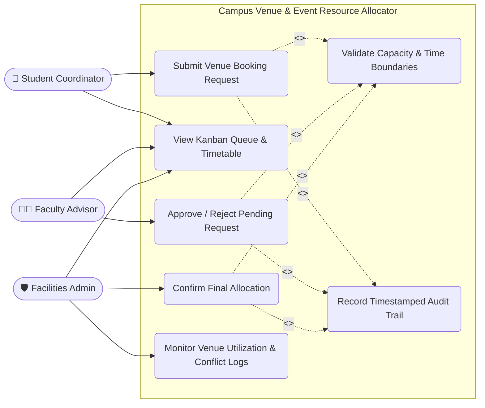
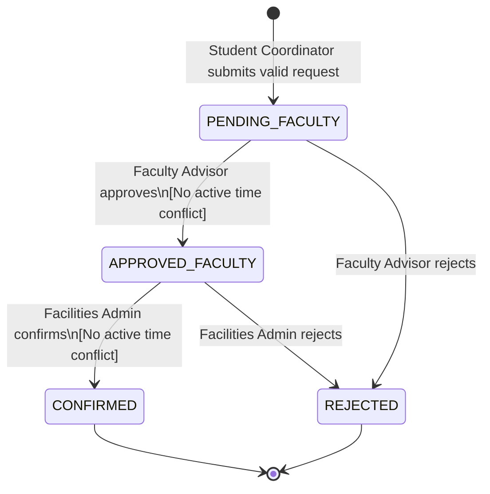
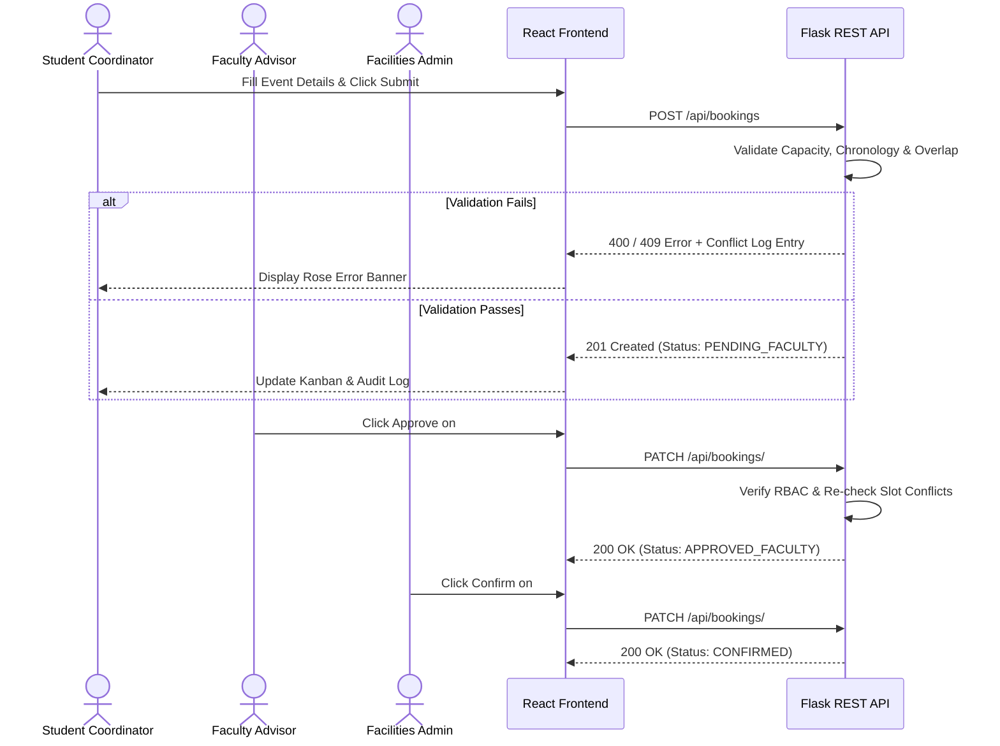
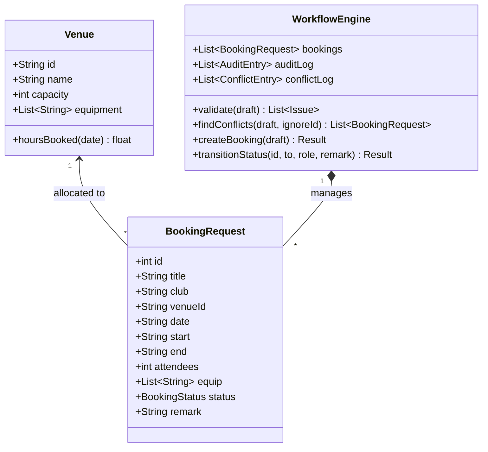

# UML System Modeling Diagrams

## 1. Use Case Diagram

```mermaid
flowchart LR
    Student(["👤 Student Coordinator"])
    Faculty(["👩‍🏫 Faculty Advisor"])
    Admin(["🛡️ Facilities Admin"])

    subgraph System ["Campus Venue & Event Resource Allocator"]
        UC1("Submit Venue Booking Request")
        UC2("Validate Capacity & Time Boundaries")
        UC3("View Kanban Queue & Timetable")
        UC4("Approve / Reject Pending Request")
        UC5("Confirm Final Allocation")
        UC6("Monitor Venue Utilization & Conflict Logs")
        UC7("Record Timestamped Audit Trail")
    end

    Student --> UC1
    Student --> UC3
    UC1 -.->|"<<include>>"| UC2
    UC1 -.->|"<<include>>"| UC7

    Faculty --> UC3
    Faculty --> UC4
    UC4 -.->|"<<include>>"| UC2
    UC4 -.->|"<<include>>"| UC7

    Admin --> UC3
    Admin --> UC5
    Admin --> UC6
    UC5 -.->|"<<include>>"| UC2
    UC5 -.->|"<<include>>"| UC7
```

## 2. State Machine Diagram (Booking Lifecycle)

```mermaid
stateDiagram-v2
    [*] --> PENDING_FACULTY : Student Coordinator submits valid request
    PENDING_FACULTY --> APPROVED_FACULTY : Faculty Advisor approves\n[No active time conflict]
    PENDING_FACULTY --> REJECTED : Faculty Advisor rejects
    APPROVED_FACULTY --> CONFIRMED : Facilities Admin confirms\n[No active time conflict]
    APPROVED_FACULTY --> REJECTED : Facilities Admin rejects
    CONFIRMED --> [*]
    REJECTED --> [*]
```

## 3. Sequence Diagram (Booking & Approval Workflow)

```mermaid
sequenceDiagram
    actor S as Student Coordinator
    actor F as Faculty Advisor
    actor A as Facilities Admin
    participant UI as React Frontend
    participant API as Flask REST API

    S->>UI: Fill Event Details & Click Submit
    UI->>API: POST /api/bookings
    API->>API: Validate Capacity, Chronology & Overlap
    alt Validation Fails
        API-->>UI: 400 / 409 Error + Conflict Log Entry
        UI-->>S: Display Rose Error Banner
    else Validation Passes
        API-->>UI: 201 Created (Status: PENDING_FACULTY)
        UI-->>S: Update Kanban & Audit Log
    end

    F->>UI: Click Approve on #ID
    UI->>API: PATCH /api/bookings/#ID/status (role=faculty, to=APPROVED_FACULTY)
    API->>API: Verify RBAC & Re-check Slot Conflicts
    API-->>UI: 200 OK (Status: APPROVED_FACULTY)

    A->>UI: Click Confirm on #ID
    UI->>API: PATCH /api/bookings/#ID/status (role=admin, to=CONFIRMED)
    API-->>UI: 200 OK (Status: CONFIRMED)
```

## 4. Class Diagram

```mermaid
classDiagram
    class Venue {
        +String id
        +String name
        +int capacity
        +List~String~ equipment
        +hoursBooked(date) float
    }

    class BookingRequest {
        +int id
        +String title
        +String club
        +String venueId
        +String date
        +String start
        +String end
        +int attendees
        +List~String~ equip
        +BookingStatus status
        +String remark
    }

    class WorkflowEngine {
        +List~BookingRequest~ bookings
        +List~AuditEntry~ auditLog
        +List~ConflictEntry~ conflictLog
        +validate(draft) List~Issue~
        +findConflicts(draft, ignoreId) List~BookingRequest~
        +createBooking(draft) Result
        +transitionStatus(id, to, role, remark) Result
    }

    Venue "1" <-- "*" BookingRequest : allocated to
    WorkflowEngine "1" *-- "*" BookingRequest : manages
```